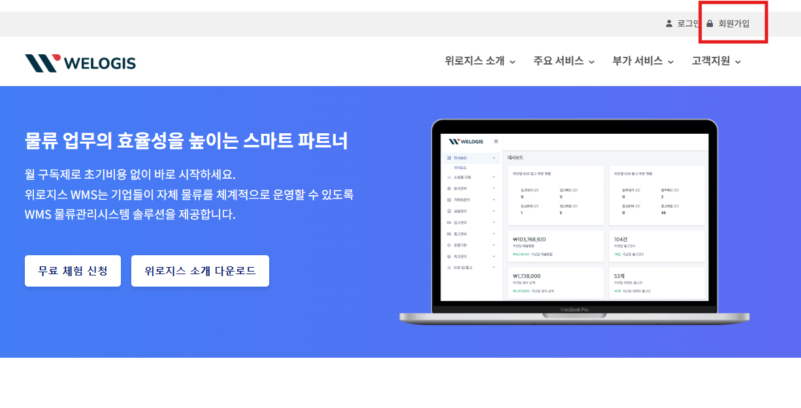
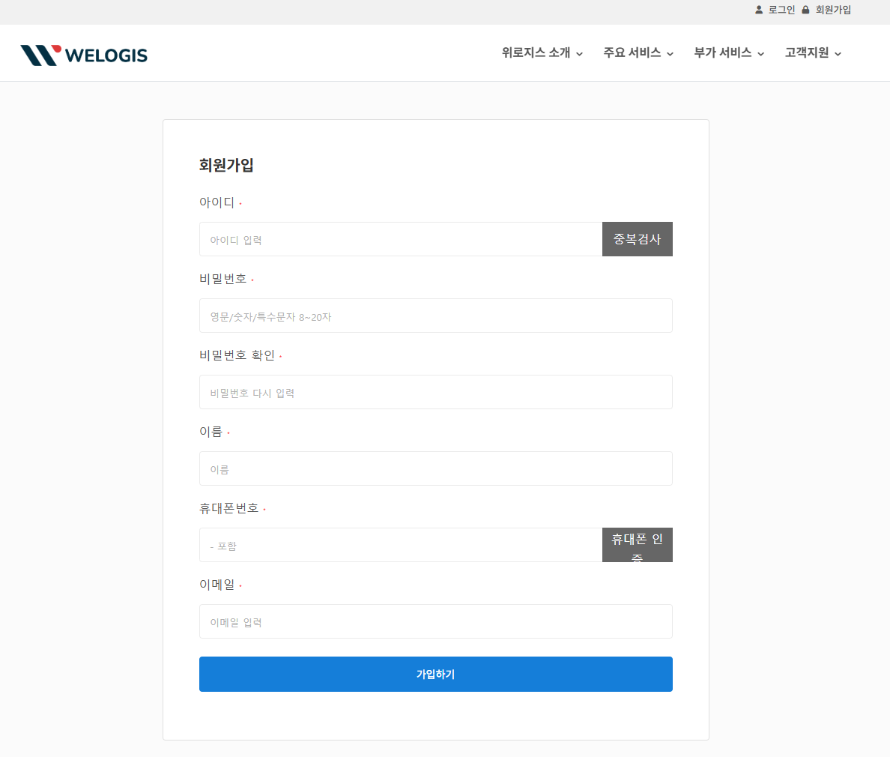
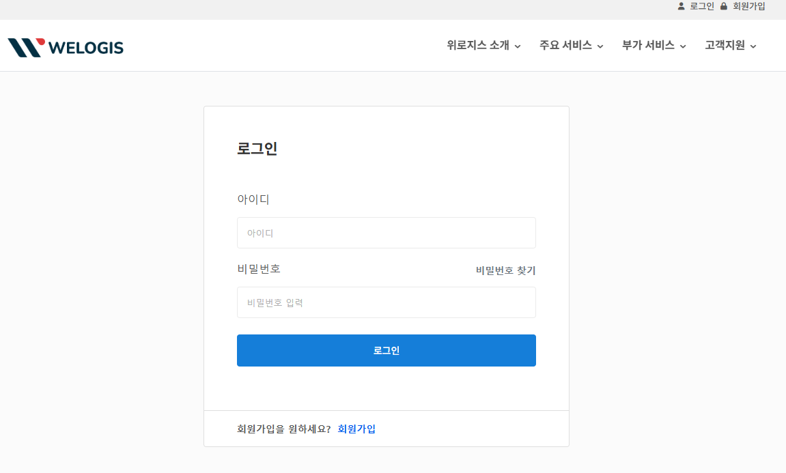
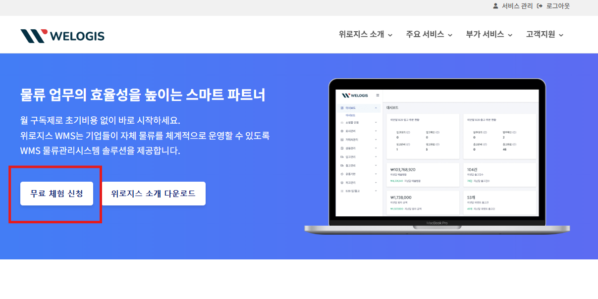
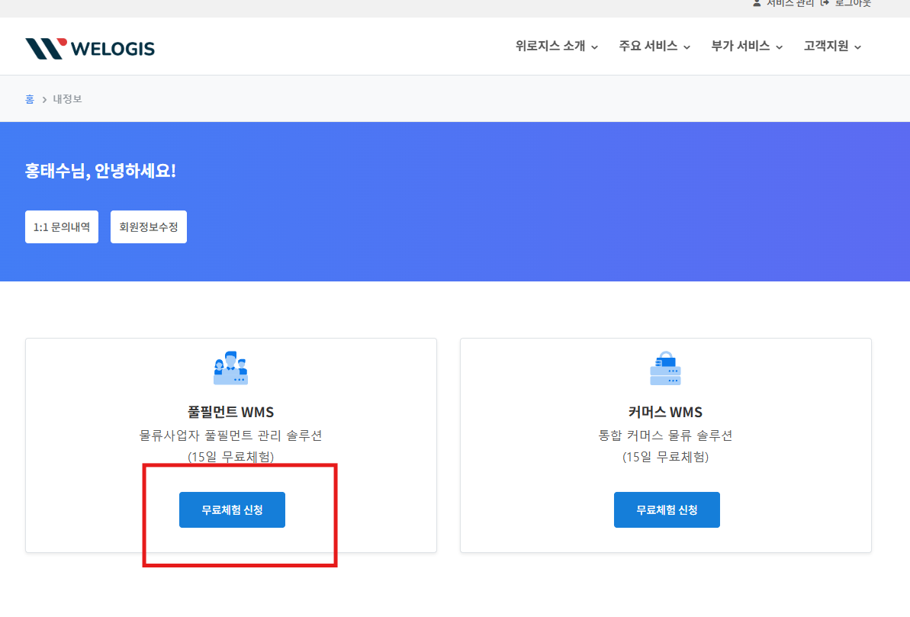

# 무료체험신청

1\. [https://www.welogis.co.kr](https://www.welogis.co.kr) 접속

&#x20;

2\. 사이트 회원가입

<figure><figcaption></figcaption></figure>

3\. 사이트 회원가입-2

<figure><figcaption></figcaption></figure>

4\. 가입아이디로 로그인

<figure><figcaption></figcaption></figure>

&#x20;

5\. 메인화면의 무료체험 신청버튼 클릭

<figure><figcaption></figcaption></figure>

&#x20;

6\. 풀필먼트 WMS의 \[무료체험신청] 버튼 클릭

<figure><figcaption></figcaption></figure>

&#x20;

&#x20;

7\. 회사 정보 기입 후 \[무료체험신청]버튼 클릭

<mark style="color:red;">**\* 서비스유형 : \[3PL 풀필먼트 WMS] 선택**</mark>

<mark style="color:red;">**\* 플랜선택 : \[플러스] 선택**</mark>

<figure><figcaption></figcaption></figure>

